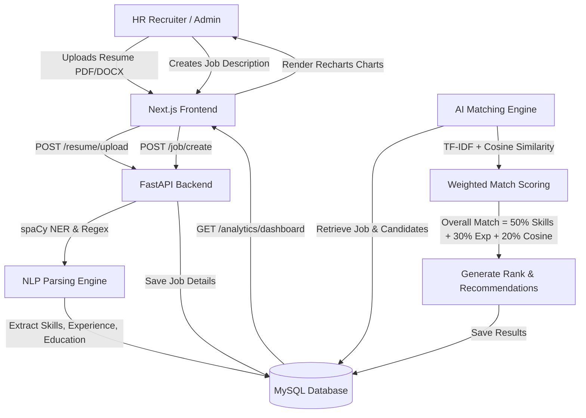

# RecruitAI Developer Handbook & API Blueprint

Welcome to the **RecruitAI** unified guide. This document serves as the absolute single source of truth for setting up, running, developing, and deploying the AI-Powered Resume Screening & Recruitment Analytics platform.

---

## 🗺️ System Architecture & Workflow

The diagram below illustrates how components interact, from resume parsing to the semantic scoring engine.



---

## 🚀 Step-by-Step Setup & Development Guide

Follow these sequential steps to set up the system manually or using Docker.

### Prerequisites
- **Python**: 3.11 or higher
- **Node.js**: 18 or higher
- **MySQL**: 8.0 or higher

### Option A: Manual Setup (Local Environment)

#### **1. Database Configuration**
Login to MySQL and create the database:
```sql
CREATE DATABASE resume_screening CHARACTER SET utf8mb4 COLLATE utf8mb4_unicode_ci;
```

#### **2. Backend (FastAPI)**
Navigate to `backend`, set up the virtual environment, install dependencies, and run:
```bash
cd backend
python -m venv venv

# Windows PowerShell:
.\venv\Scripts\Activate.ps1
# Linux/Mac:
source venv/bin/activate

# Install requirements
pip install -r requirements.txt

# Download required spaCy & NLTK models
python -m spacy download en_core_web_sm
python -m nltk.downloader punkt

# Configure Environment
copy .env.example .env

# Run FastAPI Application
python main.py
```
> [!NOTE]
> The backend runs at `http://localhost:8000`. API documentation is available at `http://localhost:8000/docs`.

#### **3. Frontend (Next.js)**
Navigate to `frontend`, install node packages, and run the development server:
```bash
cd ../frontend
npm install

# Configure Environment
echo "NEXT_PUBLIC_API_URL=http://localhost:8000/api" > .env.local

# Run Dev Server
npm run dev
```
> [!NOTE]
> The frontend runs at `http://localhost:3000`.

---

### Option B: Containerized Setup (Docker Compose)
Run the entire stack in one click:
```bash
# Build and spin up containers
docker-compose -f docker/docker-compose.yml up -d

# View live execution logs
docker-compose -f docker/docker-compose.yml logs -f

# Shut down all services
docker-compose -f docker/docker-compose.yml down
```

---

## 🛠️ API Blueprint & Endpoint Catalog

**Base URL:** `http://localhost:8000/api`

> [!IMPORTANT]
> All endpoints except `/auth/signup` and `/auth/login` require an `Authorization` header:
> `Authorization: Bearer <access_token>`

### 🔑 Authentication Endpoints

| Endpoint | Method | Payload / Headers | Description |
| :--- | :--- | :--- | :--- |
| `/auth/signup` | `POST` | `{ name, email, password, role }` | Register a new platform account |
| `/auth/login` | `POST` | `{ email, password }` | Authenticate and obtain JWT |
| `/auth/me` | `GET` | `Authorization` Bearer | Retrieve details of the current session |

---

### 📄 Resume & Candidate Endpoints

| Endpoint | Method | Description | Response Model |
| :--- | :--- | :--- | :--- |
| `/resume/upload` | `POST` | Upload & parse a PDF/DOCX file | `{ id, name, email, skills, experience, score }` |
| `/resume/candidates` | `GET` | Get paginated candidate directory | `{ candidates: [], total, page, limit }` |
| `/resume/candidate/{id}` | `GET` | Retrieve detailed candidate profile | `{ id, name, email, phone, skills, experience }` |
| `/resume/candidate/{id}` | `PUT` | Update skills, score, experience | `{ id, name, skills, experience, score }` |

---

### 💼 Job Description Endpoints

| Endpoint | Method | Description | Request / Response Sample |
| :--- | :--- | :--- | :--- |
| `/job/create` | `POST` | Create a job post | `{ title, description, required_skills, experience_required }` |
| `/job/all` | `GET` | Get all active job postings | `{ jobs: [], total }` |
| `/job/{id}` | `GET` | View job details | `{ id, title, description, required_skills }` |
| `/job/{id}` | `PUT` | Update details of a job | `{ title, required_skills }` |
| `/job/{id}` | `DELETE` | Soft-deactivate a job | `{ message: "Job deleted successfully" }` |

---

### 🤖 Matching & Analytics Endpoints

| Endpoint | Method | Description | Response Sample |
| :--- | :--- | :--- | :--- |
| `/matching/match/{job_id}` | `POST` | Match candidates to job post | `{ job_id, total_matches, matches: [] }` |
| `/matching/results/{job_id}` | `GET` | Fetch results for job match | `{ job_id, matches: [ { candidate_id, match_score } ] }` |
| `/analytics/dashboard` | `GET` | Fetch platform high-level KPIs | `{ total_candidates, total_jobs, average_match_score }` |
| `/analytics/skills` | `GET` | Get top-trending required skills | `{ data: [ { name: "React", count: 38 } ] }` |
| `/analytics/experience`| `GET` | Get distribution of candidate experience | `{ data: [ { years: "2-5", candidates: 15 } ] }` |

---

### 📊 Report Generation

| Endpoint | Method | Format | Description |
| :--- | :--- | :--- | :--- |
| `/report/generate` | `POST` | `{ job_id, format: "pdf" }` | Exports professional PDF report with graphs |
| `/report/export-candidates` | `POST` | `{ format: "excel" }` | Exports candidate base as formatting-optimized Excel |

---

## 💡 Troubleshooting & Production Readiness Checklist

### Common Port Collisions
If ports are already in use, override them on launch:
```bash
# Force Backend to run on 8001
python main.py --port 8001

# Force Frontend to run on 3001
npm run dev -- -p 3001
```

### Production Security Checklist
- [ ] Change `SECRET_KEY` in `backend/.env` to a robust generated secret.
- [ ] Ensure `DEBUG=False` in `backend/.env` to secure debug dumps.
- [ ] Restrict `CORS_ORIGINS` to exact frontend domain URL.
- [ ] Apply secure rate limits on high-frequency API endpoints.
- [ ] Verify that database inputs use parameterization (via SQLAlchemy ORM).

---

**Happy Recruiting! 🚀**
